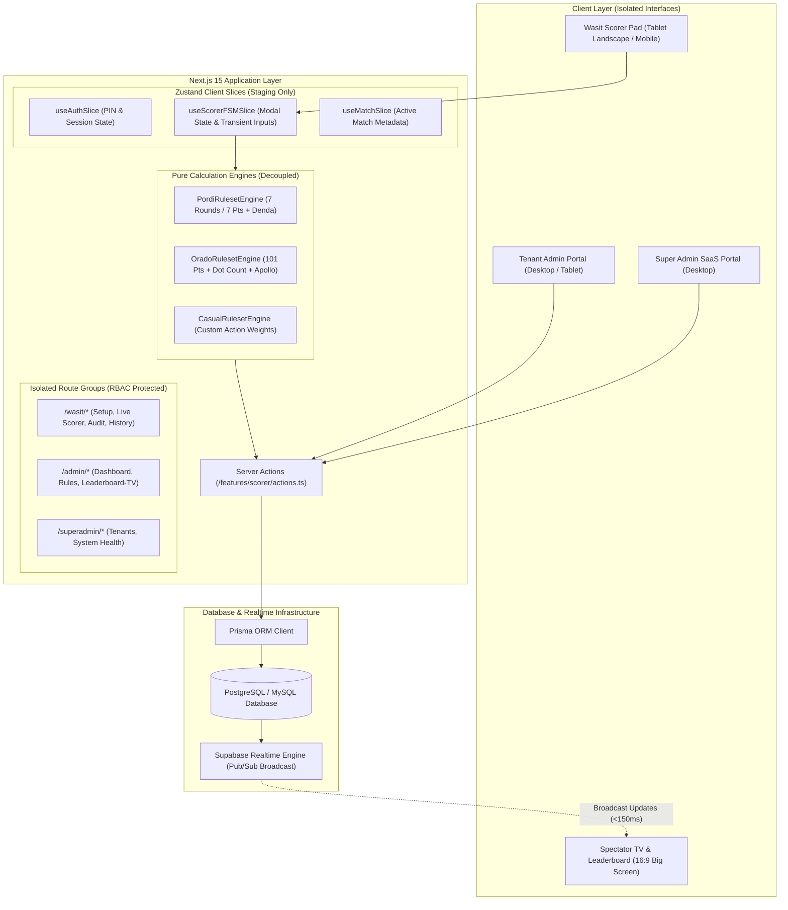
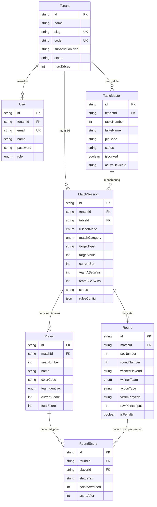
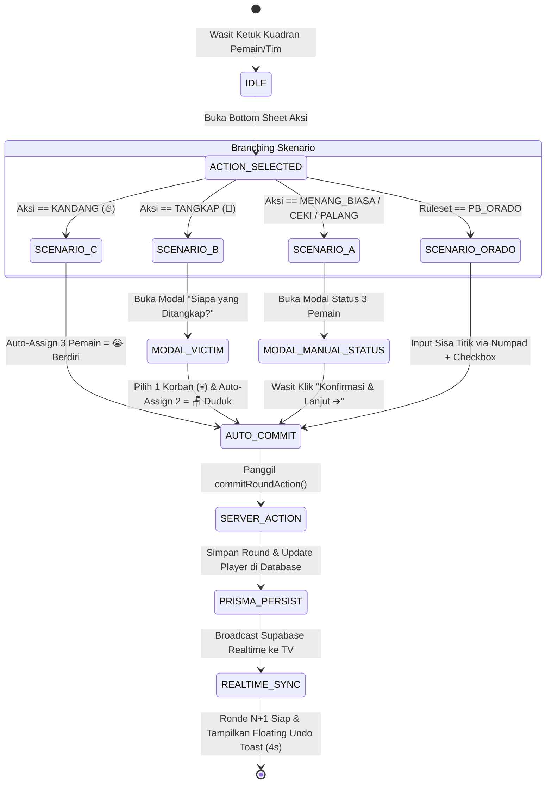

# ARCHITECTURE - Arsitektur Sistem & Desain Modul SIREDOM

> **Dokumen Arsitektur Teknikal**  
> **Sistem:** SIREDOM (Sistem Rekapitulasi Domino) v2.0  
> **Status:** Active Target Architecture (PRD v2.0 Aligned)

---

## 1. Stack Teknologi Utama

SIREDOM dibangun menggunakan arsitektur web modern yang dioptimalkan untuk performa tinggi, isolasi peran (*role-isolated*), dan resiliensi data:

- **Frontend & App Framework:** Next.js 15 (App Router, Server Actions, React 19, TypeScript)
- **Styling & UI:** Tailwind CSS v3, Lucide React (Ikon), Inter / Plus Jakarta Sans Typography
- **State Management (Client UI & Staging):** Zustand 5 (dengan arsitektur *slices* untuk FSM modal wasit dan staging data)
- **Data Persistence & ORM:** Database PostgreSQL / MySQL yang dikelola melalui Prisma ORM 6
- **Real-Time Data Sync:** Supabase Realtime JS Client / WebSockets (Pub/Sub untuk papan telemetri penonton)
- **Visualisasi Telemetri:** Recharts / HTML5 Canvas (Grafik garis akumulasi poin bergaya balap F1)
- **Keamanan & Autentikasi:** `bcryptjs` (Hashing password akun admin & validasi PIN meja wasit)

---

## 2. Diagram Arsitektur Sistem (High-Level Architecture)



---

## 3. Diagram Skema Database (ERD - Entity Relationship Diagram)

Berdasarkan skema pada `prisma/schema.prisma`:



---

## 4. Wasit Finite State Machine (Zero-Redundancy Auto-Commit)

Proses penginputan skor pada meja wasit mengeliminasi tombol simpan manual di dasbor. Mutasi ke database dieksekusi seketika pada langkah penutup masing-masing skenario:



---

## 5. Desain Ruleset Calculation Engine (Decoupled Interface)

Untuk memastikan bahwa aturan kalkulasi skor domino dapat diuji secara independen (*unit testing*) tanpa tergantung pada React atau Prisma, dibuat interface terisolasi `IRulesetEngine`:

```typescript
export interface CalculationInput {
  rulesetMode: 'CASUAL' | 'PB_PORDI' | 'PB_ORADO';
  matchCategory: 'SINGLE_1V1V1V1' | 'TEAM_2V2';
  rulesConfig: Record<string, any>;
  winnerPlayerId: string | null;
  winnerTeam: 'NONE' | 'TEAM_A' | 'TEAM_B';
  actionType: string;
  victimPlayerId?: string | null;
  manualStatuses?: Record<string, 'berdiri' | 'duduk'>;
  rawPointsInput?: number;
  isPenalty?: boolean;
  players: {
    id: string;
    seatNumber: number;
    teamIdentifier: 'NONE' | 'TEAM_A' | 'TEAM_B';
    currentScore: number;
  }[];
}

export interface CalculationResult {
  roundScores: {
    playerId: string;
    statusTag: string;
    pointsAwarded: number;
    scoreAfter: number;
  }[];
  winType: string;
  isPenalty: boolean;
}

export interface IRulesetEngine {
  calculateRound(input: CalculationInput): CalculationResult;
}
```

### Implementasi Engine:
1. **`PordiRulesetEngine`:** Menerapkan regulasi resmi PB PORDI (Target Tunggal: 7 Ronde, Ganda: 7 Poin, bobot aksi tetap, dan kalkulasi penalti denda cepat +1/+4).
2. **`OradoRulesetEngine`:** Menerapkan regulasi PB ORADO (Target Set 101 Poin, akumulasi sisa titik balak lawan, pengali Dua Ujung Cocok $\times 2$, bonus Balak Habis +50, penalti Balak 0 Mati 13 titik, dan evaluasi kemenangan mutlak Apollo).
3. **`CasualRulesetEngine`:** Menerapkan aturan santai warkop dengan bobot kustom dinamis untuk kategori Tunggal maupun Tim 2v2.

---

## 6. Sinkronisasi Real-Time & TV Telemetry

Untuk menampilkan papan skor langsung di Smart TV/Proyektor (`/admin/leaderboard-tv`) tanpa jeda dan tanpa perlu me-refresh halaman:
1. Saat wasit menyelesaikan ronde, Server Action melakukan transaksi data ke database via Prisma.
2. Handler `supabaseRealtimeBroadcast` memancarkan payload event `ROUND_COMMITTED` ke topik channel: `match:${matchId}`.
3. Komponen `LeaderboardTV` pada layar proyektor menangkap payload tersebut dan memperbarui klasemen peringkat (#1 Gold 👑, #2 Silver 🥈, #3 Bronze 🥉, #4 Brick 🧱) serta titik koordinat grafik garis telemetri secara instan (<150ms).