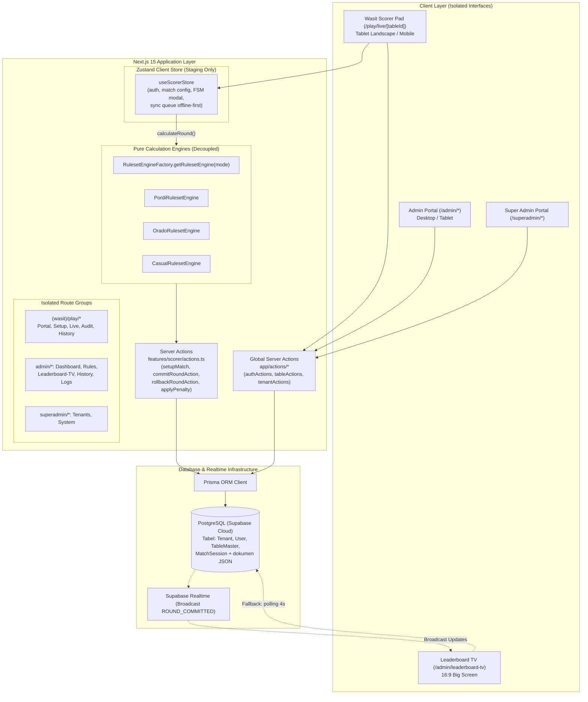
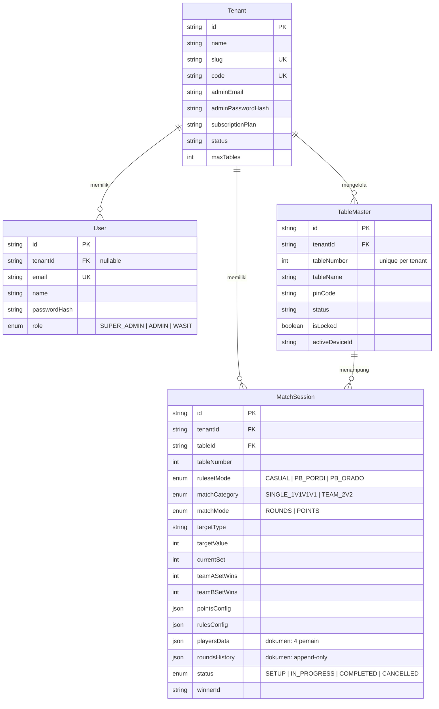
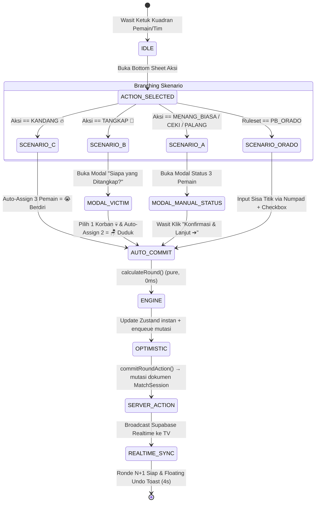

# ARCHITECTURE — Arsitektur Sistem & Desain Modul SIREDOM

> **Dokumen Arsitektur Teknikal**
> **Sistem:** SIREDOM (Sistem Rekapitulasi Domino) v2.0
> **Status:** Active Target Architecture — selaras dengan [`PRD.md`](./PRD.md) dan kode terpasang.
> **Model Data:** JSON Document-Relational ([ADR-0001](./adr/0001-json-document-relational-model.md))

---

## 1. Stack Teknologi Terpasang

- **Frontend & App Framework:** Next.js 15 (App Router, Server Actions, React 19, TypeScript 5)
- **Styling & UI:** Tailwind CSS v3, Lucide React (ikon), Framer Motion (animasi), canvas-confetti (perayaan kemenangan)
- **State Management (Client UI & Staging):** Zustand 5 (`src/store/useScorerStore.ts`)
- **Data Persistence & ORM:** PostgreSQL (Supabase Cloud) via Prisma ORM 6
- **Real-Time Sync:** Supabase Realtime JS Client (`@supabase/supabase-js`) + fallback polling di Leaderboard TV
- **Visualisasi Telemetri:** Recharts (grafik garis akumulasi poin bergaya balap F1)
- **Keamanan & Autentikasi:** `bcryptjs` (hashing password admin & verifikasi PIN meja wasit)

---

## 2. Diagram Arsitektur Sistem (High-Level)



**Status realtime (jujur terhadap kode terpasang):** halaman TV sudah berlangganan channel broadcast `ROUND_COMMITTED` dan memiliki fallback polling 4 detik; pemanggilan `broadcastRoundCommitted()` pada jalur commit/rollback Server Action adalah item kerja aktif (lihat [`ROADMAP.md`](./ROADMAP.md)).

---

## 3. Struktur Rute & Modul

```
src/
├── app/
│   ├── (wasit)/play/
│   │   ├── page.tsx                    # Portal wasit: tenant code + nomor meja + PIN
│   │   ├── layout.tsx
│   │   └── live/[tableId]/
│   │       ├── page.tsx                # Scorer pad utama (kuadran 2x2)
│   │       ├── setup/page.tsx          # Cascading setup form
│   │       ├── audit/page.tsx          # Riwayat ronde + rollback/reset
│   │       └── history/page.tsx        # Arsip sesi selesai per meja
│   ├── login/page.tsx                  # Portal Admin / Super Admin (email+password)
│   ├── admin/{dashboard,rules,leaderboard-tv,history,logs}/page.tsx
│   ├── superadmin/{tenants,system}/page.tsx
│   ├── actions/                        # Server Actions global
│   │   ├── authActions.ts              # loginAction (admin email/pass; verifikasi PIN meja)
│   │   ├── tableActions.ts             # lock/unlock meja, master data meja
│   │   └── tenantActions.ts            # operasi multi-tenant
│   ├── api/
│   │   ├── matches/route.ts            # GET daftar meja/sesi per tenant; POST aksi (lock/unlock)
│   │   ├── tables/route.ts
│   │   ├── tenants/route.ts
│   │   ├── system/logs/route.ts
│   │   └── health/route.ts
│   └── page.tsx                        # Redirect "/" → "/play"
├── components/
│   ├── wasit/                          # ScorerPadRenderer, Casual/Pordi/OradoScorerPad,
│   │                                   # PlayerCard, TeamScoreHeader, modal-modal FSM,
│   │                                   # MatchFinishedModal, VictoryAnimationOverlay
│   ├── ui/                             # Primitif UI bersama
│   ├── Numpad.tsx
│   └── Header.tsx
├── features/scorer/
│   ├── actions.ts                      # commitRoundAction, rollbackRoundAction, dst.
│   └── engine/
│       ├── types.ts                    # IRulesetEngine, CalculationInput/Result
│       ├── RulesetEngineFactory.ts
│       ├── PordiRulesetEngine.ts
│       ├── OradoRulesetEngine.ts
│       └── CasualRulesetEngine.ts
├── lib/
│   ├── prisma.ts                       # Prisma Client singleton
│   └── supabase.ts                     # Klien Supabase + broadcastRoundCommitted()
├── store/useScorerStore.ts             # Zustand store tunggal (auth + match + FSM + sync queue)
├── types/domino.ts                     # Enum & tipe domain terpusat
└── middleware.ts
prisma/
├── schema.prisma
└── seed.ts
scripts/
└── test-games-completion.ts            # Simulasi penyelesaian pertandingan
```

---

## 4. Skema Database (ERD — JSON Document-Relational)

Berdasarkan `prisma/schema.prisma` terpasang:



Enum domain lengkap (`ActionType`, `RoundStatusTag`, `TeamIdentifier`) dan bentuk dokumen `playersData`/`roundsHistory`: lihat [`PRD.md` Bagian 9](./PRD.md) dan sumber kebenaran tipenya di `src/types/domino.ts`.

---

## 5. Wasit Finite State Machine (Zero-Redundancy Auto-Commit)

Proses penginputan skor pada meja wasit mengeliminasi tombol simpan manual di dasbor. Mutasi dieksekusi pada langkah penutup masing-masing skenario:



**Pola eksekusi (sesuai kode):**
1. Engine menghitung hasil ronde secara _pure_ (tanpa I/O).
2. UI diperbarui secara optimistis (0ms); mutasi dimasukkan ke antrean sinkronisasi (`pendingSyncQueue`) — mendukung perilaku _offline-first_ PRD.
3. Worker latar memanggil Server Action; Server Action melakukan rekonsiliasi dokumen `MatchSession` (append `roundsHistory`, rekonstruksi skor `playersData`) dalam satu update Prisma.
4. Gagal jaringan → status `OFFLINE_PENDING`, antrean dicoba ulang otomatis.

---

## 6. Desain Ruleset Calculation Engine (Decoupled Interface)

Untuk memastikan aturan kalkulasi skor domino dapat diuji independen (*unit testing*) tanpa React atau Prisma, dibuat interface terisolasi `IRulesetEngine`. Sumber kebenaran: `src/features/scorer/engine/types.ts`.

```typescript
export interface IRulesetEngine {
  calculateRound(input: CalculationInput): CalculationResult;
}
```

`CalculationInput` membawa konteks penuh satu ronde: `rulesetMode`, `matchCategory`, `rulesConfig`/`pointsConfig`, identitas pemenang (`winnerPlayerId`/`winnerTeam`), `actionType`, `victimPlayerId`, `manualStatuses`, `rawPointsInput` + `oradoMultipliers` (khusus ORADO), `isPenalty`/`penaltyAmount`, snapshot `players`, serta progres pertandingan (`currentRoundsCount`, `currentSet`, `targetValue`, `matchMode`, `targetType`, `teamASetWins`, `teamBSetWins`).

`CalculationResult` mengembalikan `roundScores[]` (`statusTag`, `pointsAwarded`, `scoreAfter` per pemain), `winType`, `isPenalty`, `isMatchComplete`, plus field set ORADO (`setJustWon`, `currentSet`, `teamASetWins`, `teamBSetWins`) dan `newTargetValue` untuk overtime/tie-break.

### Implementasi Engine:

1. **`PordiRulesetEngine`:** Regulasi resmi PB PORDI (Target Tunggal: Fixed 7 Ronde, Ganda: Race to 7 Poin, bobot aksi tetap, tie-break overtime, kalkulasi penalti denda cepat +1/+4).
2. **`OradoRulesetEngine`:** Regulasi PB ORADO (Set 101 Poin Best of 3, akumulasi sisa titik batu lawan, pengali Dua Ujung Cocok ×2, bonus Balak Habis +50, penalti Balak 0 Mati 13 titik, evaluasi kemenangan mutlak Apollo).
3. **`CasualRulesetEngine`:** Aturan santai warkop dengan bobot kustom dinamis (`pointsConfig`) untuk kategori Tunggal maupun Tim 2v2.

Spesifikasi matematis tiap aturan: [`SKILLS.md`](./SKILLS.md).

---

## 7. Sinkronisasi Real-Time & TV Telemetry

Target tampilan papan skor langsung di Smart TV/Proyektor (`/admin/leaderboard-tv`) tanpa refresh:

1. Saat wasit menyelesaikan ronde, Server Action memutasi dokumen `MatchSession` via Prisma.
2. Handler `broadcastRoundCommitted(matchId, payload)` (`src/lib/supabase.ts`) memancarkan event `ROUND_COMMITTED` ke channel `match:${matchId}`.
3. Halaman TV berlangganan channel tersebut dan memperbarui klasemen peringkat (#1 Gold 👑, #2 Silver 🥈, #3 Bronze 🥉, #4 Brick 🧱) serta grafik garis telemetri (Recharts) segera.
4. **Fallback terpasang saat ini:** polling berkala 4 detik sebagai lapisan ketahanan; wiring broadcast penuh ada di [`ROADMAP.md`](./ROADMAP.md).
