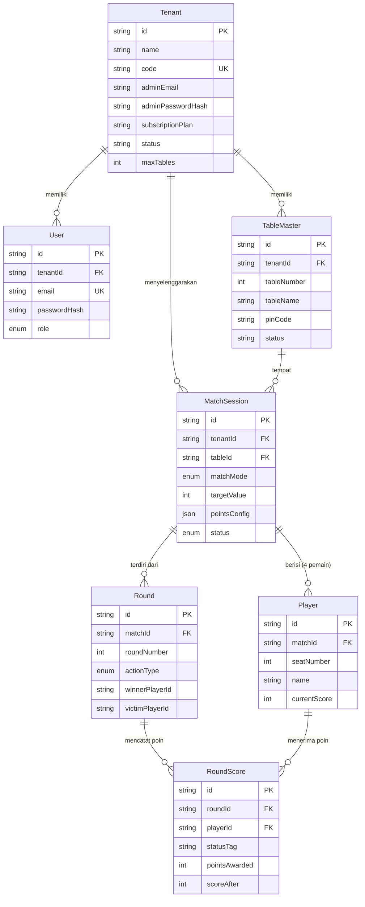
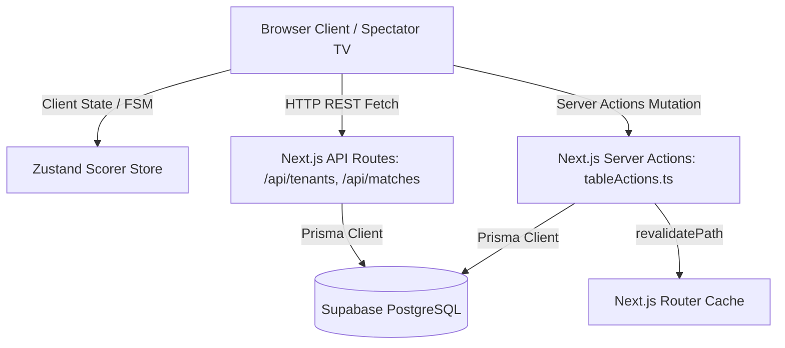

# System Architecture & Tech Stack - SIREDOM v0

Dokumen ini menjelaskan arsitektur teknis, skema relasi basis data (ERD), serta aliran data (*data flow*) pada aplikasi SIREDOM v0.

---

## 1. Technology Stack

| Layer | Teknologi Utama | Versi |
| :--- | :--- | :--- |
| **Framework** | Next.js (App Router, Server Actions) | `15.5.x` |
| **UI Engine** | React, TailwindCSS, Lucide Icons, Framer Motion | React `19`, Tailwind `3.4` |
| **State Management** | Zustand (Client FSM Engine) | `5.0` |
| **ORM & Database** | Prisma ORM, Supabase Cloud PostgreSQL | Prisma `6.4` |
| **Authentication** | Bcrypt Password Encryption (`bcryptjs`) | `3.0` |
| **Deployment** | Vercel Serverless Platform | Production |

---

## 2. Skema Database Relational (ERD)

---

## 3. Aliran Data (Data Flow Architecture)

---

## 4. Keamanan & Isolasi Data Multi-Tenant
- Setiap query `TableMaster` dan `MatchSession` secara otomatis difilter berdasarkan `tenantId` atau `tenantCode`.
- Akses Wasit memerlukan verifikasi **4-digit PIN Meja** khusus yang dicocokkan dengan record `TableMaster` di PostgreSQL.
