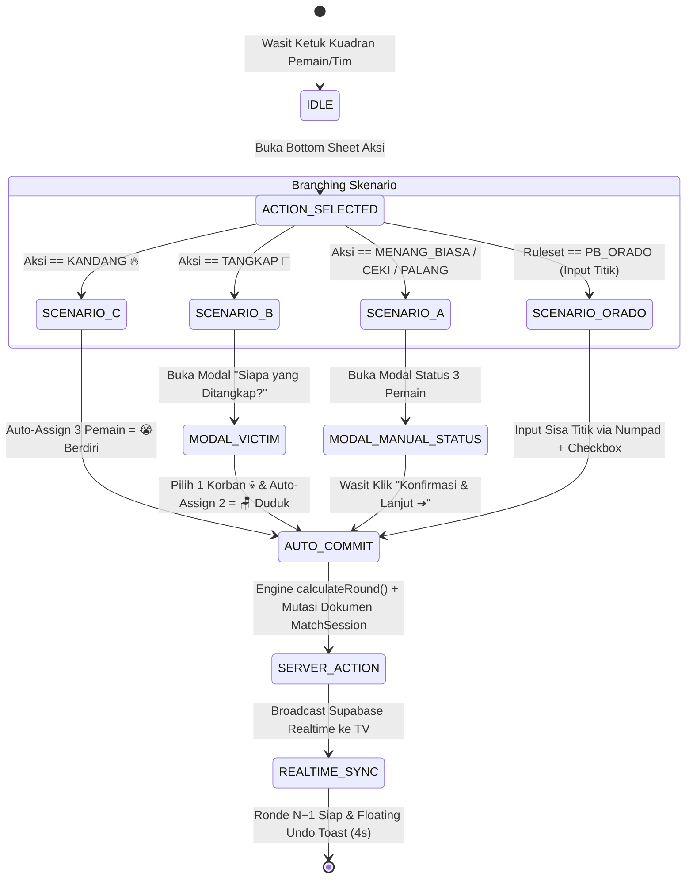

# Product Requirement Document (PRD)

## SIREDOM v2.0 — Sistem Rekapitulasi Domino

> **Sumber Kebenaran Tunggal** untuk kebutuhan produk SIREDOM.
> **Versi:** 2.0 (Gabungan PRD-SIREDOM-v2 + spesifikasi teknis terverifikasi)
> **Status:** Aktif — seluruh dokumen lain (`ARCHITECTURE.md`, `SKILLS.md`, `ROADMAP.md`, `WORKFLOW.md`, `AGENTS.md`) wajib konsisten dengan file ini.
> **Model Data:** JSON Document-Relational (lihat Bagian 9)

---

## 1. Overview

### 1.1 Latar Belakang & Masalah

Saat ini, sistem pencatatan skor pertandingan domino mayoritas masih dilakukan secara manual. Kendala terbesar di lapangan adalah variasi peraturan yang berbeda di tiap daerah (seperti gaya permainan warkop lokal), serta perbedaan sistem penilaian resmi dari federasi olahraga domino di Indonesia, yaitu PB PORDI dan PB ORADO. Sebelumnya, pencatatan digital telah diuji coba melalui SIREDOM v1 (berbasis _spreadsheet_), namun prosesnya dirasa terlalu lambat dan membutuhkan terlalu banyak input manual. Selain itu, ketiadaan sistem digitalisasi khusus menyebabkan rentannya kesalahan rekapitulasi, serta rawan terjadi tumpang tindih data (_stuck setup_) jika sistem digunakan secara bersamaan untuk banyak meja tanpa isolasi _state_ dan rute (URL) yang jelas.

### 1.2 Tujuan Utama

SIREDOM (Sistem Rekapitulasi Domino) v2.0 dibangun untuk menyediakan platform pencatatan skor berbasis web yang terstruktur, cepat, dan akurat untuk ekosistem _casual_ maupun turnamen resmi. Fokus utamanya adalah menghadirkan sistem manajemen _multi-table_ di mana setiap meja diisolasi secara ketat menggunakan _Dynamic Table Routing_ (contoh: `/play/live/[tableId]`). Melalui pendekatan _Zero-Redundancy Auto-Commit_, wasit dapat menginput hasil ronde secara seketika tanpa perlu menekan tombol simpan berulang-ulang. Semua data langsung tersinkronisasi secara _real-time_ ke sistem _Leaderboard TV_ untuk dipantau oleh penyelenggara.

Nilai tambah yang dipecahkan oleh sistem:

- **Pencegahan Human Error:** Perhitungan skor, akumulasi poin tim, dan evaluasi kondisi khusus dieksekusi otomatis oleh _pure calculation engine_ (`IRulesetEngine`).
- **Zero-Redundancy Flow:** Menghilangkan _click fatigue_ wasit dengan alur _Auto-Commit_ pada modal/langkah akhir.
- **Transparansi Real-Time:** Papan penonton / Smart TV langsung menampilkan klasemen dan grafik telemetri dinamis.
- **Single-Device Session Locking:** Mencegah tabrakan input data dengan mengunci 1 sesi pertandingan aktif pada 1 perangkat wasit (`isLocked` + `activeDeviceId` pada `TableMaster`).

### 1.3 Nilai Jual Utama (Ruleset Mode Isolation)

Berbeda dengan aplikasi skoring statis, SIREDOM v2.0 dirancang dengan arsitektur _Ruleset Mode Isolation_ yang dinamis. Antarmuka, opsi masukan (input), hingga kalkulasi menang/kalah akan berubah sepenuhnya mengikuti mode yang dipilih:

- **Mode Casual:** Menggunakan _Action-Based FSM_ untuk mencatat status permainan warkop ("kalah berdiri, menang duduk"). Opsi penyelesaian meliputi: Menang Biasa, Kandang, Ceki, Palang, dan Tangkap.
- **Mode PB PORDI:** Mendukung _Fixed 7 Ronde_ (Tunggal) atau _Race to 7 Poin_ (Ganda). Mode ini dilengkapi tambahan **Panel Denda Cepat** bagi wasit untuk memberikan penalti instan, seperti +1 (denda ringan) atau +4 (denda _passed_ palsu).
- **Mode PB ORADO:** Khusus untuk kategori Tim 2v2 dengan sistem _Set_ 101 Poin (_Best of 3 Sets_). Mode ini menampilkan _Count-Based Touch Numpad_ untuk mengkalkulasi sisa titik batu lawan, dengan perhitungan presisi untuk multiplier Dua Ujung (×2), bonus Balak Habis (+50), penalti Balak 0 Mati (13 poin), serta deteksi otomatis kemenangan mutlak _Apollo_.

### 1.4 Platform & Aksesibilitas

Untuk memastikan adopsi yang masif dan menghindari kerumitan rilis di toko aplikasi (App Store/Play Store), SIREDOM v2.0 dibangun murni sebagai **Web App**. Antarmuka (UI) dikembangkan secara _fully responsive_ dan _touch-friendly_, khususnya dioptimalkan untuk perangkat _Tablet_ (landscape) dan smartphone (landscape). Wasit di lapangan hanya perlu masuk melalui portal `/play` menggunakan Nama Penyelenggara, Nomor Meja, dan PIN Meja untuk mengakses _Scorer Pad_ berukuran besar yang sangat mudah disentuh saat pertandingan berlangsung.

---

## 2. Requirements

### 2.1 Persyaratan Aksesibilitas & Jaringan

- **Platform:** Aplikasi berbasis Web (Web App) yang dioptimalkan untuk perangkat _Mobile_ dan _Tablet_ layar sentuh (_touch-friendly_).
- **Offline-First Capability:** Sistem memerlukan koneksi internet untuk melakukan _login_ dan _setup_ meja di awal. Namun, saat berada di fase pencatatan ronde pertandingan, sistem harus bisa berjalan secara luring (_offline_) jika koneksi terputus, dan otomatis melakukan sinkronisasi data ke _server_ saat koneksi internet kembali stabil.
- **Manajemen Rute Dinamis:** Akses pengelola (Admin/Super Admin) dipusatkan pada `/login`. Akses Wasit/Panitia dialihkan ke portal `/play`, dengan URL spesifik untuk mengisolasi sesi permainan setiap meja (contoh: `/play/live/[tableId]`).

### 2.2 Spesifikasi Fitur Terisolasi (Ruleset Mode)

Sistem wajib memisahkan antarmuka dan fitur berdasarkan tiga mode pertandingan:

- **Mode Casual:** Menggunakan logika _Action-Based FSM_ (Menang Biasa, Kandang, Tangkap, Ceki, Palang).
- **Mode PB PORDI:** Selain mendukung target ronde/poin, mode ini wajib memiliki **Timedomi** (Stopwatch Digital) bawaan di dalam layar wasit yang diisolasi khusus hanya untuk mode ini guna menghitung durasi pikir pemain.
- **Mode PB ORADO:** Menggunakan _Count-Based Numpad_ untuk kalkulasi 101 poin, lengkap dengan aturan pengali ganda (_Dua Ujung Cocok_), bonus _Balak Habis_ (+50 poin), penalti _Balak 0 Mati_ (13 poin), dan deteksi _Apollo_.

### 2.3 Notifikasi & Pantauan Visual

- **Umpan Balik Visual (Tanpa Suara):** Khusus pada Mode Casual, sistem akan menampilkan animasi visual yang menarik (bergaya seperti aplikasi Duolingo) untuk setiap kondisi kemenangan yang dikirim oleh wasit.
- **Peringatan Akhir Pertandingan:** Saat _Game Poin_ tercapai di mode apa pun, sistem akan memunculkan _pop-up_ pemberitahuan "Pertandingan Berakhir" yang memuat nama pemenang beserta skor akhir dari seluruh pemain.
- **Leaderboard TV:** Terdapat halaman web khusus (_dashboard_) yang ringan untuk diproyeksikan ke Smart TV/Layar guna menampilkan pantauan klasemen seluruh meja tanpa memerlukan interaksi atau animasi tambahan.

### 2.4 Manajemen Data & Riwayat

- **Arsip Sesi per Meja:** Sistem tidak mencatat statistik permanen pemain (seperti persentase menang/kalah global), melainkan menyimpan rekapitulasi riwayat ronde untuk sesi pertandingan di meja tersebut (diakses melalui `/play/live/[tableId]/history`). Fitur ini berfungsi sebagai alat audit bagi wasit dan panitia untuk meninjau ulang jika terjadi kekeliruan pencatatan. Fitur ini bisa memilih meja mana yang ingin dilihat berdasarkan kapan pertandingannya, namun terbatas pada Nama Penyelenggaranya saja.

---

## 3. Role & Pemetaan Rute (Route Isolation)

Setiap role memiliki antarmuka dan hak akses terisolasi tanpa topbar universal:

| Role Pengguna | Tanggung Jawab Utama | Halaman yang Dapat Diakses |
| :--- | :--- | :--- |
| **Wasit Meja** | Login PIN meja, setup susunan 4 pemain fisik, pencatatan ronde berbasis modal FSM, panel denda cepat, dan audit ronde meja terkait. | • `/play` (Portal: Nama Penyelenggara + Nomor Meja + PIN)<br>• `/play/live/[tableId]/setup` (Konfigurasi Kursi & Target Match)<br>• `/play/live/[tableId]` (Dasbor Kuadran 2x2 + Modal FSM + History Pills)<br>• `/play/live/[tableId]/audit` (Log Riwayat Ronde & Rollback)<br>• `/play/live/[tableId]/history` (Arsip Match Selesai Meja Terkait) |
| **Admin (Pengelola)** | Kelola master meja, generate PIN sesi meja, konfigurasi bobot poin custom, dan kendali layar TV penonton. | • `/login` (Email/Password)<br>• `/admin/dashboard` (Manajemen Meja & Ringkasan Laga)<br>• `/admin/rules` (Preset Aturan & Poin Custom)<br>• `/admin/leaderboard-tv` (Layar Penuh TV Telemetri & Klasemen)<br>• `/admin/history` (Arsip Lengkap Multi-Meja)<br>• `/admin/logs` (Log Sistem) |
| **Super Admin** | Pengelolaan tenant (warkop/cafe/PB), kuota meja, dan log performa server. | • `/superadmin/tenants` (Manajemen Tenant & Kuota Meja)<br>• `/superadmin/system` (Server Health & Metrics Log) |

---

## 4. Core Features

Fitur-fitur utama yang wajib dikembangkan pada rilis versi pertama (MVP) SIREDOM v2.0 meliputi:

### 4.1 Autentikasi Pengelola & Portal Meja Berbasis PIN

- **Portal Pengelola (`/login`):** Halaman khusus bagi Admin atau Super Admin untuk mengelola data master, membuat turnamen, dan memantau seluruh jalannya pertandingan.
- **Portal Wasit Multi-Tenant (`/play`):** Halaman interaktif bagi wasit atau panitia lapangan untuk masuk ke sesi permainan dengan memasukkan Nama Penyelenggara (seperti Warkop/Cafe atau PB terkait), Nomor Meja, dan PIN Meja secara spesifik.

### 4.2 Dynamic Scorer Pad (Tampilan Utama Per Meja)

- **Isolasi Rute Meja (`/play/live/[tableId]`):** Setiap meja diisolasi menggunakan URL unik untuk mencegah tumpang tindih data antar meja.
- **Layout Responsif Landscape & Touch-Friendly:** Antarmuka kuadran 2x2 yang dioptimalkan untuk perangkat tablet dan layar sentuh di lapangan.
- **Panel Navigasi Ronde:** Riwayat ringkas hasil ronde (`history pills`) yang merekam aktivitas permainan secara real-time.

### 4.3 Isolasi Modul Ruleset & Mode Permainan

- **Mode Casual:** Menggunakan logika Action-Based FSM (Menang Domi, Kandang, Ceki, Palang, Tangkap) dengan modal status pemain (Berdiri/Duduk), lengkap dengan fitur otomatisasi posisi (aksi Kandang membuat 3 pemain lain otomatis berdiri) serta animasi visual interaktif.
- **Mode PB PORDI:** Mendukung target ronde/poin federasi, dilengkapi Timedomi (Stopwatch Digital) terisolasi yang diaktifkan secara manual oleh wasit saat giliran pemain berganti atau dipilih langsung, serta aturan denda khusus.
- **Mode PB ORADO:** Khusus kategori Tim 2v2 dengan format Set 101 Poin, dilengkapi Count-Based Touch Numpad dan Checkbox instan untuk memilih kondisi menang khusus (seperti pengali Dua Ujung, bonus Balak Habis, penalti Balak 0 Mati, hingga deteksi Apollo).

### 4.4 Zero-Redundancy Auto-Commit & Audit Wasit

- **Penyimpanan Instan:** Menghilangkan tombol simpan konvensional; mutasi data langsung dieksekusi ke database seketika saat wasit memilih aksi penutup ronde.
- **Fitur Rollback & Reset Meja (`/audit`):** Hak akses khusus bagi wasit di meja terkait untuk melakukan pembatalan (`rollback`) ronde apabila terjadi kekeliruan pencatatan, serta opsi untuk mengatur ulang (`reset`) permainan kembali ke ronde pertama.

### 4.5 Live Telemetry Leaderboard TV

- **Pantauan Beragam (`/admin/leaderboard-tv`):** Dasbor berbasis web untuk diproyeksikan ke Smart TV atau proyektor dengan pilihan mode tampilan yang fleksibel, meliputi penayangan meja satuan pilihan, tampilan grid keseluruhan meja, serta mode `slideshow` otomatis berganti per meja.

---

## 5. Matriks Regulasi & Aturan Permainan

| Fitur / Parameter | Mode Casual (Default) | Mode PB PORDI | Mode PB ORADO |
| :--- | :--- | :--- | :--- |
| **Kategori Pertandingan** | Tunggal (1v1v1v1) & Tim (2v2) | Tunggal (1v1v1v1) & Tim/Ganda (2v2) | Khusus Tim / Ganda (2v2) |
| **Mekanisme Penilaian** | Action-Based FSM (Bobot Poin Dapat Disesuaikan) | Action-Based FSM (Bobot Poin Tetap) | Count-Based Scoring (Sisa Titik Batu) |
| **Kondisi Selesai Laga** | Opsi: *Fixed Rounds* / *Race to Points* | • Tunggal: **Fixed 7 Ronde**<br>• Ganda: **Race to 7 Poin** | • **Race to 101 Poin** per Set<br>• Sistem **Best of 3 Sets** |
| **Pembuka Ronde 1 (Smash Off)** | Bebas / Sesuai Pengaturan Setup Meja | Wajib Pemegang **Balak 6** (Enam-Enam) | Wajib Pemegang **Balak 0** (Kosong-Kosong) |
| **Pembuka Ronde N+1** | Pemenang ronde sebelumnya | Pemain yang **Domi** di ronde sebelumnya | Looping berputar: Balak 1 → 2 → ... → 6 → 0 |
| **Aksi & Bobot Poin** | • Menang Biasa: +1<br>• Kandang: +2<br>• Ceki: +3<br>• Palang: +4<br>• Tangkap: +3 (Korban −3)<br>• Berdiri / Duduk: sesuai konfigurasi | • Domi Biasa: +1<br>• Domi Balak: +2<br>• Ceki Biasa: +2, Ceki Habis/Balak: +3<br>• Ceki Palang / Apollo: +4<br>• Kandang: +2 (Ganda) / +3 (Tunggal) | • Sisa titik batu lawan di tangan<br>• Dua Ujung Cocok: Poin titik ×2<br>• Balak Ujung Habis: Poin titik + 50<br>• Batu Macet: ×2 jika penutup kalah |
| **Fitur Denda Pelanggaran** | Tidak ada denda instan | **Tombol Denda Cepat Wasit:**<br>• Ringan: **+1 Poin Lawan**<br>• Passed Palsu: **+4 Poin Lawan**<br>(rincian lengkap: `SKILLS.md`) | Penalti otomatis **Balak 0 Mati = 13 Titik** |
| **Kemenangan Mutlak** | Tidak ada | Tidak ada | **Apollo:** Jika set mencapai 101 vs 0 poin, menang 2 set langsung. |

Spesifikasi matematis lengkap tiap ruleset dirujuk ke [`SKILLS.md`](./SKILLS.md).

---

## 6. User Flow

Alur kerja operasional penggunaan SIREDOM v2.0 dirancang untuk memastikan proses pencatatan berjalan ringkas, minim intervensi manual, dan terisolasi per meja:

### 6.1 Alur Masuk Wasit & Autentikasi Meja

- **Input Manual Kredensial Meja:** Wasit atau panitia mengakses portal `/play` dan menginput secara manual _Nama Penyelenggara_ (contoh: Warkop/Cafe atau PB terkait), _Nomor Meja_, dan _PIN Meja_ untuk memastikan setiap meja diakses secara eksklusif oleh satu perangkat saja.
- **Deteksi Sesi Belum Disetup:** Setelah berhasil masuk, sistem memeriksa status meja. Jika meja belum pernah disetup, sistem secara otomatis memunculkan _pop-up_ untuk mengarahkan wasit ke halaman konfigurasi awal.

### 6.2 Alur Pengaturan Awal Pertandingan (Setup Match)

Konfigurasi di `/play/live/[tableId]/setup`, wasit melengkapi parameter pertandingan yang meliputi:

1. _Mode Permainan:_ Memilih antara Casual, PB PORDI, atau PB ORADO.
2. _Jenis Pertandingan:_ Memilih format Tunggal (1v1v1v1) atau Tim (2v2).
3. _Nama & Posisi Pemain:_ Mengisi nama keempat pemain sesuai kursi masing-masing.
4. _Konfigurasi Spesifik Ruleset:_
   - Jika Casual: Mengatur Target (Mode Ronde/Poin) dan aturan poin untuk setiap kondisi kemenangan.
   - Jika PB PORDI / PB ORADO: Menyesuaikan parameter rinci sesuai ketentuan federasi.
5. _Eksekusi Mulai:_ Menekan tombol "Simpan dan Mulai Pertandingan" untuk mengunci sesi ke ID meja terkait.

### 6.3 Alur Pencatatan Ronde (Scorer Pad)

- **Fokus Pemantauan Lapangan:** Di halaman utama `/play/live/[tableId]`, wasit dapat fokus mengamati jalannya pertandingan dan mengaktifkan _Timedomi_ secara manual saat giliran pemain berganti.
- **Input Pemenang & Eksekusi Instan:** Saat ronde berakhir, wasit (a) memilih pemain yang menang, (b) memilih aksi penutup ronde, dan (c) data langsung tersimpan otomatis (_auto-commit_) tanpa memerlukan tombol simpan konvensional.

### 6.4 Alur Penyelesaian Pertandingan & Audit

- **Peringatan Akhir Meja:** Ketika batas akhir pertandingan tercapai (seperti target ronde PORDI atau 101 poin ORADO), sistem langsung mengunci meja dan memunculkan _pop-up_ pemberitahuan pemenang beserta ringkasan skor akhir.
- **Fitur Rollback Mandiri Wasit:** Jika terjadi kekeliruan pencatatan, wasit di meja tersebut dapat mengakses menu `/audit` untuk melakukan pembatalan (_rollback_) 1 ronde sebelumnya secara mandiri atau mengatur ulang (_reset_) permainan kembali ke ronde pertama.

---

## 7. Spesifikasi Antarmuka & UX

### 7.1 Pre-Match Setup (`/play/live/[tableId]/setup`)

- **Cascading Configuration Form:**
  1. *Ruleset Mode:* Segmented switch `[ Casual ]` | `[ PB PORDI ]` | `[ PB ORADO ]`.
  2. *Match Category:* `[ Tunggal (1v1v1v1) ]` | `[ Tim (2v2) ]` (Otomatis terkunci ke Tim 2v2 jika memilih ORADO).
  3. *Seating Map Form:*
     - Tunggal: Input nama independen Kursi 1 (Merah), Kursi 2 (Biru), Kursi 3 (Hijau), Kursi 4 (Kuning).
     - Tim 2v2: Input Tim A (Kursi 1 Merah + Kursi 3 Hijau) & Tim B (Kursi 2 Biru + Kursi 4 Kuning).
  4. *Target & Point Rules:* Terisi otomatis (*auto-filled default*) sesuai regulasi mode yang dipilih.
- Tombol utama "Simpan & Mulai Pertandingan" melebar penuh (`w-full`) sesuai lebar kartu form.

### 7.2 Main Scorer Pad (`/play/live/[tableId]`)

- **Layout & App Feel:** Mode landscape tablet sentuh murni, `h-screen`, `overflow-hidden` (mencegah scroll horizontal/vertikal yang tidak diinginkan).
- **Quadrant Grid (2x2):**
  - **Identitas Warna Ranking:**
    - Peringkat 1: Border & Aksen Gold + Emoji 👑
    - Peringkat 2: Border & Aksen Silver + Emoji 🥈
    - Peringkat 3: Border & Aksen Bronze + Emoji 🥉
    - Peringkat 4: Border & Aksen Brick / Rust + Emoji 🧱
  - **Riwayat 5 Ronde Terakhir (History Pills):** Deretan 5 status ronde terakhir secara horizontal di bawah nama pemain (contoh: `[👑 R21] [🔥 R22] [✅ R23] [😭 R24] [👑 R25]`).
  - **Winstreak Milestone:** Badge pencapaian visual jika pemain/tim memenangkan 3x, 5x, atau 10x ronde berturut-turut.
  - **Team Score Aggregator Bar (Khusus Mode Tim 2v2):** Akumulasi total skor Tim A vs Tim B di bagian atas layar.

---

## 8. Mesin Scoring & Alur Auto-Commit (Zero-Redundancy Flow)

Tombol statis "Simpan & Lanjut" di bawah dasbor ditiadakan. Sistem mengeksekusi *commit* langsung pada aksi/modal penutup:



### 8.1 Fitur Tambahan & Mekanisme Khusus

- **Fitur Denda Cepat Wasit (Khusus PB PORDI):** Panel denda instan (+1 Ringan, +4 Passed Palsu). Memilih pemain pelanggar langsung menghadiahkan poin ke lawan dan memutasi catatan denda ke riwayat ronde.
- **Timedomi (Khusus PB PORDI):** Stopwatch digital dalam layar wasit, diaktifkan manual saat giliran pemain berganti.
- **Tie-Breaker / Overtime (Fixed Rounds):** Jika ronde terakhir tercapai dan terjadi skor seri pada Peringkat 1, sistem otomatis mengaktifkan *Additional Round (Overtime)* hingga muncul 1 juara mutlak.
- **Floating Undo Toast:** Notifikasi melayang 4 detik: `"Ronde [N] Tersimpan"` `[ ↺ Urungkan ]`. Tombol urungkan mengeksekusi *rollback* instan ke database.

---

## 9. Model Data: JSON Document-Relational

SIREDOM menggunakan model data **hybrid**: struktur relasional untuk data master, dan dokumen JSON untuk state sesi pertandingan yang berubah cepat.

### 9.1 Prinsip

| Lapisan | Isi | Bentuk |
| :--- | :--- | :--- |
| **Relasional (tabel)** | `Tenant`, `User`, `TableMaster`, `MatchSession` (metadata sesi) | Baris-tabel PostgreSQL via Prisma |
| **Dokumen (kolom JSON)** | `MatchSession.playersData`, `MatchSession.roundsHistory`, `MatchSession.pointsConfig`, `MatchSession.rulesConfig` | Array objek JSON di dalam `MatchSession` |

Keputusan desain ini (mengapa bukan tabel `Player`/`Round`/`RoundScore` ternormalisasi) direkam pada [ADR-0001](./adr/0001-json-document-relational-model.md).

### 9.2 Entitas Relasional (ringkasan)

- **Tenant** — akun penyelenggara (warkop/cafe/PB): `name`, `slug`, `code`, kuota `maxTables`, `subscriptionPlan`, `status`.
- **User** — akun Admin/Super Admin: `email`, `passwordHash`, `role` (`SUPER_ADMIN | ADMIN | WASIT`), terikat `tenantId`.
- **TableMaster** — meja fisik per tenant: `tableNumber` (unik per tenant), `tableName`, `pinCode`, `status`, `isLocked`, `activeDeviceId`.
- **MatchSession** — satu sesi pertandingan per meja: `rulesetMode` (`CASUAL | PB_PORDI | PB_ORADO`), `matchCategory` (`SINGLE_1V1V1V1 | TEAM_2V2`), `matchMode` (`ROUNDS | POINTS`), `targetType`, `targetValue`, `currentSet`, `teamASetWins`, `teamBSetWins`, `status` (`SETUP | IN_PROGRESS | COMPLETED | CANCELLED`), `winnerId`.

Enum pendukung: `ActionType` = `MENANG_BIASA | KANDANG | CEKI | PALANG | TANGKAP | ORADO_COUNT | DENDA_POIN`; `RoundStatusTag` = `MENANG | DITANGKAP | BERDIRI | DUDUK | DENDA`; `TeamIdentifier` = `NONE | TEAM_A | TEAM_B`.

### 9.3 Bentuk Dokumen JSON

```jsonc
// MatchSession.playersData : Json (array, 4 item)
[
  {
    "id": "uuid",
    "seatNumber": 1,
    "name": "Nama Pemain",
    "teamIdentifier": "TEAM_A",      // NONE | TEAM_A | TEAM_B
    "currentScore": 0,
    "totalScore": 0
  }
]

// MatchSession.roundsHistory : Json (array, append-only)
[
  {
    "id": "uuid",
    "setNumber": 1,
    "roundNumber": 1,
    "actionType": "MENANG_BIASA",
    "winnerPlayerId": "uuid",
    "winnerTeam": "NONE",
    "victimPlayerId": null,
    "winType": "...",
    "rawPointsInput": 0,             // khusus ORADO_COUNT
    "isPenalty": false,
    "timestamp": "ISO-8601",
    "scores": [
      {
        "playerId": "uuid",
        "seatNumber": 1,
        "statusTag": "MENANG",       // RoundStatusTag
        "pointsAwarded": 1,
        "scoreAfter": 1
      }
    ]
  }
]
```

Aturan integritas dokumen: skor akhir setiap pemain **harus** dapat direkonstruksi dari `roundsHistory` (lihat mesin rekalkulasi pada `SKILLS.md` Bagian 4). Rollback membuang ronde terakhir lalu merekonstruksi ulang skor dari sisa riwayat.

Skema Prisma lengkap dan aktual: [`prisma/schema.prisma`](../prisma/schema.prisma).

---

## 10. Design & Technical Constraints

Bagian ini mengatur batasan teknis dan panduan desain yang harus dipatuhi tanpa mendikte pemilihan library secara spesifik.

1. **High-Level Technology:**
   Sistem harus dibangun menggunakan teknologi modern yang mendukung pengembangan cepat (*rapid development*) dan kemudahan pemeliharaan (*maintainability*). Pengembang dibebaskan memilih tools yang tepat selama tidak terikat pada stack spesifik secara kaku, namun tetap memprioritaskan performa dan skalabilitas untuk penggunaan skala kecil hingga menengah. Stack terpasang saat ini didokumentasikan pada [`ARCHITECTURE.md`](./ARCHITECTURE.md).

2. **Typography Rules:**
   Sistem antarmuka (UI) wajib menggunakan konfigurasi font variable sebagai berikut untuk menjaga konsistensi visual:
   - **Sans:** `Geist Mono, ui-monospace, monospace`
   - **Serif:** `serif`
   - **Mono:** `JetBrains Mono, monospace`

---

## 11. Kriteria Penerimaan (Acceptance Criteria)

- **Database & Persistence:**
  - Semua mutasi skor tersimpan langsung di database (dokumen `MatchSession` dimutasi via Server Actions).
  - Pergantian perangkat, refresh browser, atau gangguan jaringan singkat tidak mereset data pertandingan; antrean mutasi luring tersinkron ulang otomatis.
- **Kepatuhan Aturan Federasi:**
  - **PB PORDI:** Mode Tunggal mengunci target ke 7 Ronde, Mode Ganda mengunci ke 7 Poin. Tombol denda +1 & +4 berfungsi menambah poin lawan.
  - **PB ORADO:** Mengunci kategori ke Tim 2v2, target 101 Poin (_Best of 3 Sets_), input sisa titik kartu lawan, dan deteksi Apollo.
- **UX & Scoring Wasit:**
  - Kandang (🔥) *auto-commit* dalam 2 klik.
  - Tangkap (🚓) *auto-commit* dalam 3 klik.
  - Menang Biasa / Ceki / Palang *auto-commit* setelah konfirmasi status 3 pemain.
  - Notifikasi Undo melayang 4 detik dan berhasil membatalkan ronde jika ditekan.
- **Live Telemetry & Spectator TV:**
  - `/admin/leaderboard-tv` memperbarui klasemen dan grafik telemetri segera setelah wasit melakukan *commit* ronde (target <150ms dari broadcast realtime; fallback polling saat broadcast belum aktif).
