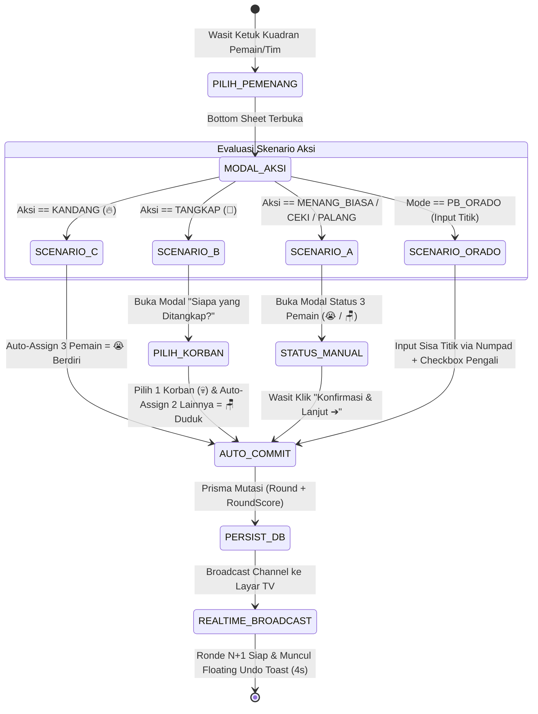

# Product Requirement Document (PRD)
## SIREDOM: Multi-Ruleset & Tournament Referee Engine

**Document Version:** 2.0 (Final Architecture & Ruleset Revision)  
**Status:** Approved for Production Implementation  
**Platform:** Multi-Tenant Web SaaS (Next.js 15 App Router, React 19, Prisma ORM, PostgreSQL / MySQL Database, Zustand, Supabase Realtime)

---

## 1. Ikhtisar & Latar Belakang

**SIREDOM (Sistem Rekapitulasi Domino)** adalah platform SaaS multi-tenant yang dirancang khusus untuk memodernisasi pencatatan, kalkulasi skor otomatis berbasis *Finite State Machine* (FSM), serta rekapitulasi pertandingan domino secara real-time.

SIREDOM mendukung 3 mode regulasi permainan (**Casual / Santai Warkop**, Standar Nasional **PB PORDI**, dan **PB ORADO**) serta 2 kategori pertandingan (**Tunggal 1v1v1v1** dan **Tim/Ganda 2v2**).

Sistem ini memecahkan berbagai permasalahan pada pencatatan manual:
- **Pencegahan Human Error:** Perhitungan skor, akumulasi poin tim, dan evaluasi kondisi khusus dieksekusi otomatis oleh *pure calculation engine*.
- **Zero-Redundancy Flow:** Menghilangkan *click fatigue* wasit dengan alur *Auto-Commit* pada modal/langkah akhir.
- **Transparansi Real-Time:** Papan penonton / Smart TV langsung menampilkan klasemen dan grafik telemetri dinamis via WebSockets/Supabase Realtime.
- **Single-Device Session Locking:** Mencegah tabrakan input data dengan mengunci 1 sesi pertandingan aktif pada 1 perangkat wasit.

---

## 2. Definisi Role & Pemetaan Rute Halaman (Route Isolation)

Setiap role memiliki antarmuka dan hak akses terisolasi tanpa topbar universal:

| Role Pengguna | Tanggung Jawab Utama | Halaman yang Dapat Diakses |
| :--- | :--- | :--- |
| **Wasit Meja** | Login PIN meja, setup susunan 4 pemain fisik, pencatatan ronde berbasis modal FSM, panel denda cepat, dan audit ronde meja terkait. | • `/login` (Mode Wasit via Touch Numpad PIN)<br>• `/wasit/setup` (Konfigurasi Kursi & Target Match)<br>• `/wasit/live` (Dasbor Kuadran 2x2 + Modal FSM + History Pills)<br>• `/wasit/audit` (Log Riwayat Ronde & Rollback)<br>• `/wasit/history` (Arsip Match Selesai Meja Terkait) |
| **Admin (Pengelola Cafe)** | Kelola master meja, generate PIN sesi meja, konfigurasi bobot poin custom, dan kendali layar TV penonton. | • `/login` (Mode Admin Email/Password)<br>• `/admin/dashboard` (Manajemen Meja & Ringkasan Laga)<br>• `/admin/rules` (Preset Aturan & Poin Custom)<br>• `/admin/leaderboard-tv` (Layar Penuh TV Telemetri & Klasemen)<br>• `/admin/history` (Arsip Lengkap Turnamen Multi-Meja) |
| **Super Admin** | Pengelolaan tenant cafe/warkop, lisensi langganan (*subscription billing*), kuota meja, dan log performa server. | • `/superadmin/tenants` (Manajemen Tenant & Kuota Meja)<br>• `/superadmin/system` (Server Health & Metrics Log) |

---

## 3. Matriks Regulasi & Aturan Permainan

| Fitur / Parameter | Mode Casual (Default) | Mode PB PORDI | Mode PB ORADO |
| :--- | :--- | :--- | :--- |
| **Kategori Pertandingan** | Tunggal (1v1v1v1) & Tim (2v2) | Tunggal (1v1v1v1) & Tim/Ganda (2v2) | Khusus Tim / Ganda (2v2) |
| **Mekanisme Penilaian** | Action-Based FSM (Bobot Poin Tetap) | Action-Based FSM (Bobot Poin Tetap) | Count-Based Scoring (Sisa Titik Batu) |
| **Kondisi Selesai Laga** | Opsi: *Fixed Rounds* / *Race to Points* | • Tunggal: **Fixed 7 Gocokan/Ronde**<br>• Ganda: **Race to 7 Poin** | • **Race to 101 Poin** per Set<br>• Sistem **Best of 3 Sets** |
| **Pembuka Ronde 1 (Smash Off)** | Bebas / Sesuai Pengaturan Setup Meja | Wajib Pemegang **Balak 6** (Enam-Enam) | Wajib Pemegang **Balak 0** (Kosong-Kosong) |
| **Pembuka Ronde $N+1$** | Pemenang ronde sebelumnya | Pemain yang **Domi** di ronde sebelumnya | Looping berputar: Balak 1 $\rightarrow$ 2 $\rightarrow$ ... $\rightarrow$ 6 $\rightarrow$ 0 |
| **Aksi & Bobot Poin** | • Menang Biasa: +1<br>• Kandang: +2<br>• Ceki: +3<br>• Palang: +4<br>• Tangkap: +3 (Korban -3)<br>• Berdiri: 0 / -1, Duduk: 0 | • Domi Biasa: +1<br>• Domi Balak: +2<br>• Ceki Biasa: +2, Ceki Habis/Balak: +3<br>• Ceki Palang / Apollo: +4<br>• Kandang: +2 (Ganda) / +3 (Tunggal) | • Sisa titik batu lawan di tangan<br>• Dua Ujung Cocok: Poin titik $\times 2$<br>• Balak Ujung Habis: Poin titik + 50<br>• Batu Macet: $\times 2$ jika penutup kalah |
| **Fitur Denda Pelanggaran** | Tidak ada denda instan | **Tombol Denda Cepat Wasit:**<br>• Ringan: **+1 Poin Lawan**<br>• Passed Palsu: **+4 Poin Lawan** | Penalti otomatis **Balak 0 Mati = 13 Titik** |
| **Kemenangan Mutlak** | Tidak ada | Tidak ada | **Apollo:** Jika set mencapai 101 vs 0 poin, menang 2 set langsung. |

---

## 4. Spesifikasi Antarmuka & UX

### 4.1. Pre-Match Setup (`/wasit/setup`)
- **Cascading Configuration Form:**
  1. *Ruleset Mode:* Segmented switch `[ Casual ]` | `[ PB PORDI ]` | `[ PB ORADO ]`.
  2. *Match Category:* `[ Tunggal (1v1v1v1) ]` | `[ Tim (2v2) ]` (Otomatis terkunci ke Tim 2v2 jika memilih ORADO).
  3. *Seating Map Form:*
     - Tunggal: Input nama independen Kursi 1 (Merah), Kursi 2 (Biru), Kursi 3 (Hijau), Kursi 4 (Kuning).
     - Tim 2v2: Input Tim A (Kursi 1 Merah + Kursi 3 Hijau berhadapan) & Tim B (Kursi 2 Biru + Kursi 4 Kuning berhadapan).
  4. *Target & Point Rules:* Terisi otomatis (*auto-filled default*) sesuai regulasi mode yang dipilih.
- **Button Styling:** Tombol utama *"Simpan & Mulai Sesi Wasit"* melebar penuh (`w-full`) sesuai lebar kartu form.

### 4.2. Main Scorer Pad (`/wasit/live`)
- **Layout & App Feel:** Mode landscape tablet sentuh murni, `h-screen`, `overflow-hidden` (mencegah scroll horizontal/vertikal yang tidak diinginkan).
- **Quadrant Grid (2x2):**
  - **Identitas Warna Ranking:**
    - Peringkat 1: Border & Aksen Gold + Emoji 👑
    - Peringkat 2: Border & Aksen Silver + Emoji 🥈
    - Peringkat 3: Border & Aksen Bronze + Emoji 🥉
    - Peringkat 4: Border & Aksen Brick / Rust + Emoji 🧱
  - **Riwayat 5 Ronde Terakhir (History Pills):** Menampilkan deretan 5 status ronde terakhir secara horizontal di bawah nama pemain (contoh: `[👑 R21] [🔥 R22] [✅ R23] [😭 R24] [👑 R25]`). Teks statis "+3 Ronde Lalu" dihapus.
  - **Winstreak Milestone:** Badge pencapaian visual jika pemain/tim memenangkan 3x, 5x, atau 10x ronde berturut-turut.
  - **Team Score Aggregator Bar (Khusus Mode Tim 2v2):** Menampilkan akumulasi total skor Tim A vs Tim B di bagian atas layar.

---

## 5. Mesin Scoring & Alur Auto-Commit (Zero-Redundancy Flow)

Tombol statis "Simpan & Lanjut" di bawah dasbor ditiadakan. Sistem mengeksekusi *commit* langsung ke database dan memajukan ronde secara otomatis pada aksi/modal penutup:



### 5.1. Fitur Tambahan & Mekanisme Khusus
- **Fitur Denda Cepat Wasit (Khusus PB PORDI):** Tombol melayang `[ +1 Denda ]` dan `[ +4 Denda Passed ]` di sudut layar. Memilih pemain pelanggar langsung menghadiahkan poin ke lawan dan memutasi catatan denda ke tabel `RoundScore`.
- **Tie-Breaker / Overtime (Fixed Rounds):** Jika ronde terakhir tercapai (misal Ronde 7 PORDI Tunggal) dan terjadi skor seri pada Peringkat 1, sistem otomatis mengaktifkan *Additional Round (Overtime)* hingga muncul 1 juara mutlak.
- **Floating Undo Toast:** Notifikasi melayang 4 detik di bawah layar: `"Ronde [N] Tersimpan"` `[ ↺ Urungkan ]`. Tombol urungkan mengeksekusi *rollback* instan ke database.

---

## 6. Skema Database Prisma (`prisma/schema.prisma`)

```prisma
datasource db {
  provider = "postgresql"
  url      = env("DATABASE_URL")
  directUrl = env("DIRECT_URL")
}

generator client {
  provider = "prisma-client-js"
}

enum UserRole {
  SUPER_ADMIN
  CAFE_ADMIN
  WASIT_MEJA
}

enum RulesetMode {
  CASUAL
  PB_PORDI
  PB_ORADO
}

enum MatchCategory {
  SINGLE_1V1V1V1
  TEAM_2V2
}

enum TeamIdentifier {
  NONE
  TEAM_A
  TEAM_B
}

model Tenant {
  id               String         @id @default(uuid())
  name             String
  slug             String         @unique
  code             String         @unique
  subscriptionPlan String         @default("monthly")
  status           String         @default("active")
  maxTables        Int            @default(4)
  createdAt        DateTime       @default(now())
  updatedAt        DateTime       @updatedAt

  users            User[]
  tables           TableMaster[]
  matches          MatchSession[]
}

model User {
  id        String   @id @default(uuid())
  tenantId  String
  email     String   @unique
  name      String
  password  String
  role      UserRole @default(CAFE_ADMIN)
  createdAt DateTime @default(now())
  updatedAt DateTime @updatedAt

  tenant    Tenant   @relation(fields: [tenantId], references: [id], onDelete: Cascade)
}

model TableMaster {
  id             String         @id @default(uuid())
  tenantId       String
  tableNumber    Int
  tableName      String
  pinCode        String
  status         String         @default("AVAILABLE") // AVAILABLE, IN_MATCH
  isLocked       Boolean        @default(false)
  activeDeviceId String?
  createdAt      DateTime       @default(now())
  updatedAt      DateTime       @updatedAt

  tenant         Tenant         @relation(fields: [tenantId], references: [id], onDelete: Cascade)
  matches        MatchSession[]
}

model MatchSession {
  id            String         @id @default(uuid())
  tenantId      String
  tableId       String
  rulesetMode   RulesetMode    @default(CASUAL)
  matchCategory MatchCategory  @default(SINGLE_1V1V1V1)
  targetType    String         // "FIXED_ROUNDS" | "RACE_TO_POINTS" | "SET_101"
  targetValue   Int            @default(25)
  currentSet    Int            @default(1)
  teamASetWins  Int            @default(0)
  teamBSetWins  Int            @default(0)
  status        String         @default("IN_PROGRESS") // IN_PROGRESS, FINISHED
  rulesConfig   Json           // Bobot poin custom atau multiplier flag ORADO
  createdAt     DateTime       @default(now())
  updatedAt     DateTime       @updatedAt

  tenant        Tenant         @relation(fields: [tenantId], references: [id], onDelete: Cascade)
  table         TableMaster    @relation(fields: [tableId], references: [id], onDelete: Cascade)
  players       Player[]
  rounds        Round[]
}

model Player {
  id             String         @id @default(uuid())
  matchId        String
  seatNumber     Int            // 1, 2, 3, 4
  name           String
  colorCode      String         // red, blue, green, yellow
  teamIdentifier TeamIdentifier @default(NONE)
  currentScore   Int            @default(0)
  totalScore     Int            @default(0)
  createdAt      DateTime       @default(now())

  match          MatchSession   @relation(fields: [matchId], references: [id], onDelete: Cascade)
  roundScores    RoundScore[]
}

model Round {
  id             String         @id @default(uuid())
  matchId        String
  setNumber      Int            @default(1)
  roundNumber    Int
  winnerPlayerId String?
  winnerTeam     TeamIdentifier @default(NONE)
  actionType     String         // MENANG_BIASA, KANDANG, CEKI, PALANG, TANGKAP, ORADO_COUNT, DENDA
  victimPlayerId String?
  rawPointsInput Int            @default(0)
  isPenalty      Boolean        @default(false)
  createdAt      DateTime       @default(now())

  match          MatchSession   @relation(fields: [matchId], references: [id], onDelete: Cascade)
  scores         RoundScore[]
}

model RoundScore {
  id             String   @id @default(uuid())
  roundId        String
  playerId       String
  statusTag      String   // MENANG, BERDIRI, DUDUK, DITANGKAP, DENDA_RINGAN, DENDA_BERAT
  pointsAwarded  Int
  scoreAfter     Int
  createdAt      DateTime @default(now())

  round          Round    @relation(fields: [roundId], references: [id], onDelete: Cascade)
  player         Player   @relation(fields: [playerId], references: [id], onDelete: Cascade)
}
```

---

## 7. Kriteria Penerimaan (Acceptance Criteria)

- **Database & Persistence:**
  - Semua mutasi skor tersimpan langsung di database via Prisma.
  - Pergantian mode desktop/mobile atau refresh browser tidak mereset data pertandingan.
- **Kepatuhan Aturan Federasi:**
  - **PB PORDI:** Mode Tunggal mengunci target ke 7 Ronde, Mode Ganda mengunci ke 7 Poin. Tombol denda +1 & +4 berfungsi menambah poin lawan.
  - **PB ORADO:** Mengunci target ke 101 Poin (Best of 3 Sets) dengan input sisa titik kartu lawan dan deteksi Apollo.
- **UX & Scoring Wasit:**
  - Kandang (🔥) *auto-commit* dalam 2 klik.
  - Tangkap (🚓) *auto-commit* dalam 3 klik.
  - Menang Biasa / Ceki / Palang *auto-commit* setelah konfirmasi status 3 pemain.
  - Notifikasi Undo melayang 4 detik dan berhasil membatalkan ronde jika ditekan.
- **Live Telemetry & Spectator TV:**
  - `/admin/leaderboard-tv` memperbarui grafik garis dan klasemen secara instan (<150ms) saat wasit melakukan *commit* ronde.